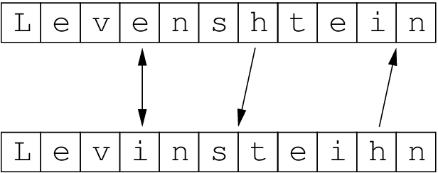

# golev
[Lavenshtein Algorithm](https://en.wikipedia.org/wiki/Levenshtein_distance) implementation in [go](https://go.dev/)

## Getting started
1. Install [go](https://go.dev/) compiler. I recommend [tinygo](https://tinygo.org/)
2. Build the executable
``` console
(tinygo|go) build -o <PROGRAM> main.go
```

## Usage
Run `./<PROGRAM>` to see the usage
``` console
Usage: <PROGRAM> <file1path> <file2path>
```
Example
``` console
./<PROGRAM> example_text_1 example_text_2
- a
- p
+ b
- p
+ a
  l
- e
+ l
```

## Copyrights
Licensed under [@MIT](./LICENSE)
